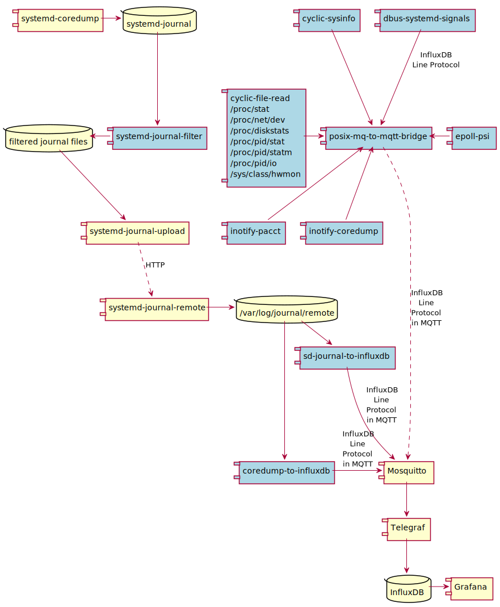
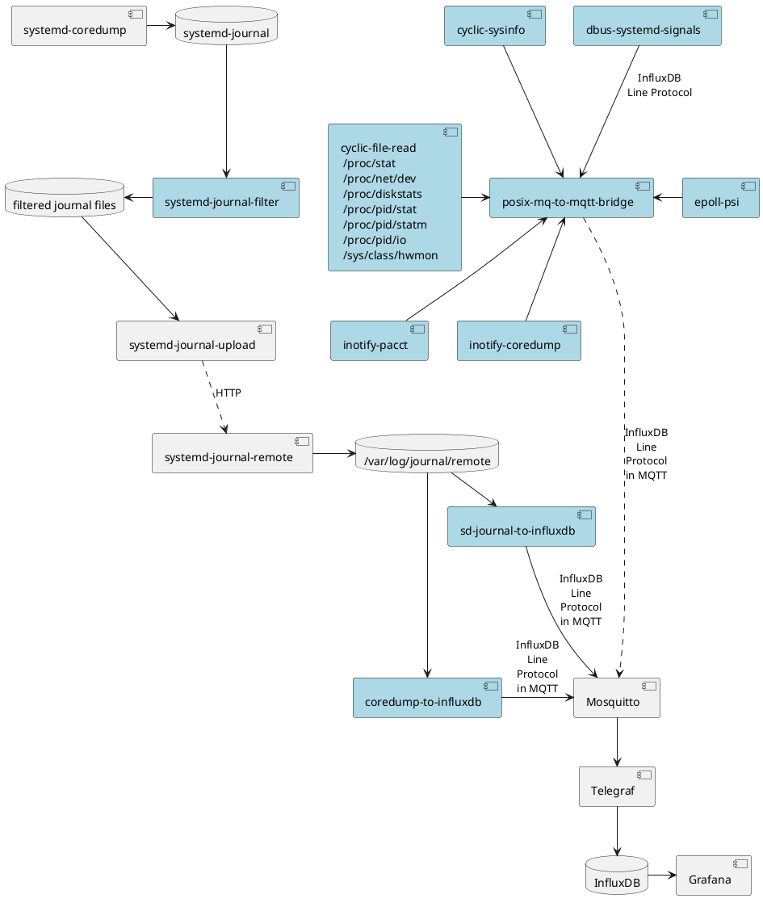

# Linux System Monitoring

## 1. Overall System

- A system monitoring for Raspberry Pi-like target devices
- Statistics and logs collection on the target device via carefully selected
  APIs
- Send data from target device to server using MQTT and HTTP
- Server for storing and analyzing statistics and logs
- The system shall be developed on Raspberry Pi OS Lite and Ubuntu for target
  device and server.
- A pre-configured Ubuntu VM and multiple pre-configured Raspberry Pis are
  provided by the customer.
- The monitoring system shall be tested on all Raspberry Pi models that are
  provided.
- Clean Code shall be produced from the beginning of the project for all
  software components
- For C code, stick to Systemd's coding style
  (<https://systemd.io/CODING_STYLE/>) and use their `.clang-format` and
  `.editorconfig` files
- The produced code shall be divided into two Git repositories:
  - logs-recording: software related to system logs and core dumps
  - stats-recording: software for statistics recording

## 2. Server

- Use a Mosquitto MQTT broker in order to receive statistics from target devices
- InfluxDB as database for storing statistics data
- Use Telegraf for reading statistics from Mosquitto and writing to InfluxDB
- Meaningful visualization of statistics in Grafana
- Receive Systemd Journal logs from target devices using
  `systemd-journal-remote(8)` and store them in its binary on-disk format
  (<https://www.freedesktop.org/wiki/Software/systemd/journal-files/>)
- All server components shall be set up in Docker containers and executed using
  Docker Compose
- For Mosquitto, Telegraf, InfluxDB and Grafana, the Docker Official Images
  shall be used. The remaining server components (systemd-journald and core dump
  related) shall be installed in a single custom container.
- There shall be as few settings and configurations outside of Docker containers
  as possible
- Setting up the server shall be documented carefully

### Components for the custom container

#### systemd-journal-remote

- Configure this component appropriately

#### sd-journal-to-influxdb

- Extract important events from systemd journal files and write them to InfluxDB
  via MQTT
- Implementation language: C
- APIs: `sd-journal(3)`, <https://eclipse.github.io/paho.mqtt.c/MQTTClient/html/>

#### coredump-to-influxdb

- Read core dump metrics from journal files and write to InfluxDB via MQTT
- Implement this component in a Bash script using `coredumpctl(1)` and
  `mosquitto_pub(1)`

## 3. Statistics Collection on Target Devices

- Design principles
  - _Minimal invasive_: collecting statistics shall be minimal invasive; we try
    to decide on the most appropriate Linux APIs to achieve this
  - Statistics collection shall be divided into _multiple components_. A system
    admin can decide on which components to enable, depending on the run-time
    cost he is willing to pay. E.g. enabling the core dump monitoring has very
    low impact on the system, while collecting all system logs might have a
    noticiable impact on network traffic.
  - Components functionality shall be rather _separated by API_ than by
    statistics type. It should be possible for the user to know what is
    happening when using these tools.
- The preferred way to read statistics is to `epoll(7)` them. If this is not
  possible, statistics shall be read cyclically using an event loop.
- Instead of `sleep(3)`, use `timerfd_create(2)` to create event loops for any
  cyclic reading of statistics
- All statistics collection components shall send their data in InfluxDB Line
  Protocol format to the `posix-mq-to-mqtt-bridge`
  (<https://docs.influxdata.com/influxdb/v2/reference/syntax/line-protocol/>)
  - For some components, protocol examples are given. This shall be implemented
    accordingly for the others.
- All components for statistics collection shall be implemented in C
- Executables shall use `getopt(3)` to parse command line arguments
  - `-c`: duty cycle in case of cyclic reading
  - `-v`: verbose; print Line Protocol lines
- Create Systemd service units for runtime management
  - Documentation: `systemd.unit(5)`, `systemd.service(5)`
- Use `make(1)` as a build system
- Build all components with Gitlab CI/CD
- Deployment in Debian packages
- Create a man page for each tool (You can re-use the man pages' text in the SEP
  documents)
- Alls configurations shall be set up by the Debian packages. In case a
  configuration cannot be set up by a Debian package, document this carefully.
- Setting up a Raspberry Pi shall be documented carefully.
- Create "buggy" demonstration apps for all collected statistics (e.g. high CPU
  consumption, memory leak, core dump)

### Components

#### cyclic-sysinfo

- Cyclic reading of statistics reported by `sysinfo(2)`
- Convert statistics to InfluxDB Line Protocol and pass to
  `posix-mq-to-mqtt-bridge`

  ```sh
  sysinfo uptime=12345,...,procs=4332 1556813561098000000
  ```

#### cyclic-file-read

- This component is for all interfaces from procfs and sysfs that require cyclic
  reading of files
- There shall be one executable which makes use of APIs as specified in command
  line flags:
  - one flag per API
  - no flag: use all APIs
  - `--pid`: use all `/proc/<pid>` APIs
  - `--sys`: use all APIs for system-level statistics
- APIs:

  - `proc(5)`

    - `/proc/stat`

      - flag: `--proc-stat`
      - calculate percentages for each CPU metric (user, nice, system, ...) and
        convert to Line Protocol format like this:

        ```sh
        # one line for overall stats
        proc-stat,core=cpu user=15.32,nice=1.98,...,ctxt=2623452345 1556813561098000000
        # one more line for each cpu core
        proc-stat,core=cpu0 user=12.98,nice=2.77,... 1556813561098000000
        ```

    - `/proc/net/dev`

      - flag: `--proc-net-dev`
      - covert to Line Protocol

        ```sh
        # one line per interface and direction
        proc-net-dev,interface=eth0,direction=receive bytes=7744,... 1556813561098000000
        ...
        ```

    - `/proc/diskstats`

      - flag: `--proc-diskstats`
      - covert to Line Protocol

        ```sh
        # one line per disk
        proc-diskstats,major=259,minor=0,name=nvme1n1 reads_completed=234324,... 1556813561098000000
        ```

    - `/proc/<pid>/stat`

      - flag: `--proc-pid-stat`
      - iterate through all PIDs and create one line for each

    - `/proc/<pid>/statm`

      - flag: `--proc-pid-statm`

    - `/proc/<pid>/io`
      - flag: `--proc-pid-io`

  - `sysfs(5)`
    - `/sys/class/hwmon/*` via `libsensors(3)`
      <https://www.kernel.org/doc/Documentation/hwmon/sysfs-interface>
      - flag: `--hwmon`
      - Read sensors which make use of the kernels hardware monitoring framework
      - On Pi, reports chip temperature(s)

#### epoll-psi

- Read pressure stall information (PSI)
- API: `/proc/pressure` for system level and `/sys/fs/cgroup` for cgroups level
  - <https://docs.kernel.org/accounting/psi.html>
- Enabled by `psi=1` via kernel command-line parameters
- Shall be `epoll(7)`ed
- A lower bound for updates shall be configurable via command line parameter
  `-c`
- Line Protocol

  ```sh
  psi,ressource=cpu,stalled=some avg10=0.00,avg60=0.00,avg300=0.00,total=104367008 1556813561098000000
  ```

#### inotify-pacct

- BSD-style process accounting
- APIs: `acct(2)`, `acct(5)`, `inotify(7)`
- `/var/log/pacct` shall be monitored using `inotify(7)`

#### inotify-coredump

- Monitor `/var/lib/systemd/coredump` for quickly notifying the server about a
  core dump
- API: `inotify(7)`

#### dbus-systemd-signals

- Read systemd events, e.g. service starting/stopping
- This is a cheaper way of monitoring systemd events than reading systemd logs
- API:
  <https://www.freedesktop.org/software/systemd/man/latest/org.freedesktop.systemd1.html#Signals>
- Convert events to Line Protocol format

#### posix-mq-to-mqtt

- All data collectors shall use POSIX message queues to send their metrics in
  Line Protocol format to this component
- Add a hostname tag to each line, e.g.: `host=pi-beef`
- Transfer data to the server using MQTT
- APIs: `mq_overview(7)` + `epoll(7)`, `gethostname(2)`,
  <https://eclipse.github.io/paho.mqtt.c/MQTTClient/html/>

#### systemd-journal-filter

- Read logs from `systemd-journald(8)` and filter by unit
- Select units which might be of interest like e.g. `systemd-coredump@*.service`
- Implement this in a bash script using a command like this: `journalctl -o
export -u ... -u ... | systemd-journal-remote -o /tmp/dir/foo.journal -`
- Provide filtered logs as temporary files to `systemd-journal-upload(8)`
- Make sure to read each log only once using a cursor as implemented by
  `journalctl(1)`

#### systemd-journal-upload(8)

- Configure this component appropriately

#### systemd-coredump(8)

- Configure this component for writing core dumps to `systemd-journald(8)`. Like
  this, we make use of the journal's transfer solution to also transfer core
  dumps to the server.

## Component Diagram



<details>
  <summary>Show PlantUML code</summary>



</details>


